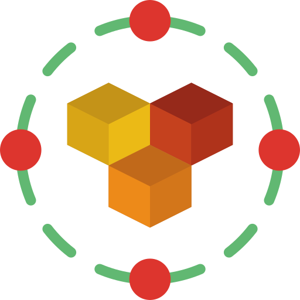

# Apio

[](https://drone.monkiato.com/monkiato/apio)
[](https://codecov.io/gh/monkiato/apio)
[](https://goreportcard.com/report/github.com/monkiato/apio)


A dynamic REST API server, using a manifest file to specify available collections

## Features

 - Multiple collections
 - Specify collection schema (field names and types)
 - Autogenerated generic REST API endpoints (GET, PUT, POST, DELETE)
 - Scheme validations on PUT or POST operations
 - List all available endpoints (for dev environments)
 - MongoDB as main database
 
 
## Manifest Declaration

the manifest is a json formatted file with a list of collections to be populated in the API.

The default path is `/app/manifest.json`, or can be changed through the environment variable `MANIFEST_PATH`

expected fields per collection:

 - name: collection name used for the url
 - fields: list of field names and types to be used

e.g.

```go
[
  {
    "name": "books",
    "fields": {
      "title": "string",
      "author": "string",
      "year": "float",
      ...
    }
  },
  ... // more collections
]
```

Available endpoints for the collection mentioned above:

```go
// get a single element
GET     http://myurl.com/api/books/{id}

// create a new element
PUT     http://myurl.com/api/books/

// update existing element
POST    http://myurl.com/api/books/{id}

// delete existing element
DELETE  http://myurl.com/api/books/{id}

// list elements
// skip: (default 0) skip the first X elements
// limit: (default 20) fetch X amount of element 
GET     http://myurl.com/api/books/
GET     http://myurl.com/api/books/?skip=10
GET     http://myurl.com/api/books/?limit=5
GET     http://myurl.com/api/books/?skip=10&limit=5
```

A sample file can be found in *manifest.sample.json*


## Available Field Types

 - string
 - float (any numeric field)
 - bool
 
## Available Storage Types

 - `mongodb` (default) requires a MongoDB connection, check environment parameters for configuration
 - `memory` in-memory database, useful for dev environment to prevent external DB connection
 
 
## Build Docker Image

Create Docker Image:

`docker build . -t apio-server`


## Run Docker Container

An example is available in docker-compose.yml 

A MongoDB is required for the default storage mode

Custom environment arguments:

    MONGODB_USERNAME: {db_username} //(mandatory) mongoDB username
    MONGODB_PASSWORD: {db_password} //default '', mongoDB password
    MONGODB_HOST: "{host}:{port}"   //default localhost:27017
    MONGODB_NAME: {db_name}         //default 'apio'
    MANIFEST_PATH: {custom}         //default /app/manifest.json
    DEBUG_MODE: 1                   //default 0, enable verbose logs
    STORAGE_TYPE: {type}            //default 'mongodb'

A volume mapping is required in order to provide the manifest file:

    volumes:
      - "{your-local-path}:/app/manifest.json"

# 'Apio' Logo

<div>Icons made by <a href="https://www.flaticon.com/authors/freepik" title="Freepik">Freepik</a> from <a href="https://www.flaticon.com/" title="Flaticon">www.flaticon.com</a></div>